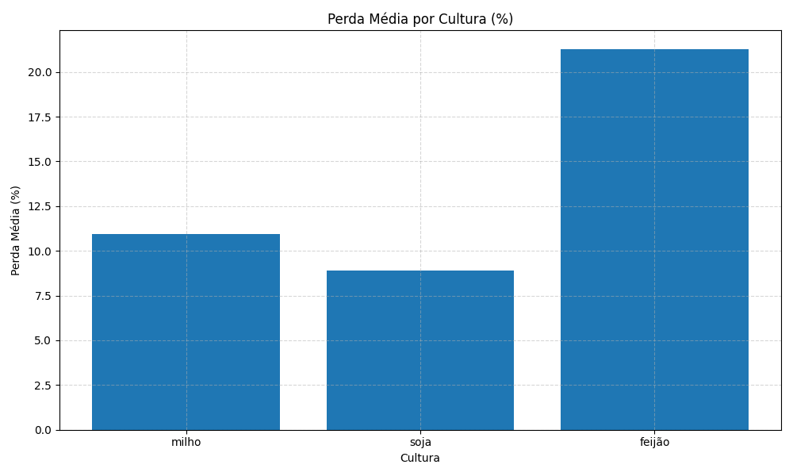

# 🌾 Sistema de Controle de Perdas Agrícolas

Este projeto tem como objetivo oferecer uma solução simples, eficiente e interativa para **gerenciar perdas na produção agrícola**, atendendo a uma necessidade crítica do agronegócio: **o acompanhamento de produtividade e perdas por cultura**.

---

## 🧩 Objetivo da Solução

Monitorar e analisar as perdas agrícolas por cultura, permitindo:

- Registro de produções estimadas e reais
- Análise percentual de perdas
- Geração de gráficos por cultura
- Exportação e importação de dados via JSON e Oracle
- Edição e exclusão de registros
- Verificação de alterações antes de sair do sistema

---

## ✅ Funcionalidades

- [x] Registrar novas perdas agrícolas
- [x] Listar e filtrar perdas por cultura
- [x] Editar ou excluir registros salvos
- [x] Exibir estatísticas e gráfico de perdas médias
- [x] Exportar e importar dados via JSON e banco Oracle
- [x] Interface amigável em terminal com validação de dados
- [x] Proteção contra perda de dados ao sair sem salvar

---

## 🛠️ Tecnologias e Conteúdos Aplicados

Esta solução contempla os conteúdos requisitados da disciplina de Python:

| Recurso | Aplicação |
|--------|-----------|
| **Subalgoritmos** | Funções e métodos com parâmetros (`create`, `filter_by_culture`, `load_from_json`, etc.) |
| **Estruturas de dados** | Listas, dicionários, tuplas, dataclasses |
| **Manipulação de arquivos** | JSON com leitura/escrita estruturada |
| **Conexão com banco de dados** | Integração com Oracle usando `oracledb` |
| **Gráficos estatísticos** | Geração de gráficos com `matplotlib` |
| **Validação de entrada** | Módulo `validators.py` protege contra entradas inválidas |

---

## 📦 Requisitos

- Python 3.10+
- Dependências do `requirements.txt`:

```bash
pip install -r requirements.txt
```

---

## ⚙️ Como Executar

1. Clone o repositório:
   ```bash
   git clone https://github.com/seu-usuario/agro_app.git
   cd agro_app
   ```

2. Execute o sistema:
   ```bash
   python main.py
   ```

---

## 📁 Estrutura do Projeto

```
.
├── main.py               # Interface principal (menu)
├── core.py               # Regras de negócio (HarvestLoss, HarvestReport)
├── database.py           # Conexão e controle do banco Oracle
├── db_config.py          # Configuração via .env
├── validators.py         # Validação de entradas do usuário
├── logger_config.py      # Sistema de logs
├── data.json             # Armazenamento local
├── perdas_por_cultura.png # Gráfico gerado
├── .env                  # Configuração do banco Oracle
├── requirements.txt      # Dependências do projeto
```

---

## 📊 Exemplo de Gráfico Gerado



---

## 🚀 Inovação e Usabilidade

- Interface via terminal clara e interativa
- Gravação automática no banco com verificação de duplicidade
- Detecção de alterações em memória antes de sair do sistema
- Sistema de log com separação de mensagens de erro e debug
- Exportação segura e controlada de dados

---

## 👨‍🌾 Conclusão

Este sistema visa **otimizar a gestão das perdas agrícolas**, promovendo **eficiência, controle e visualização clara** dos impactos por cultura. Atende integralmente aos requisitos da atividade da disciplina, com aplicação prática dos conhecimentos estudados.

---
